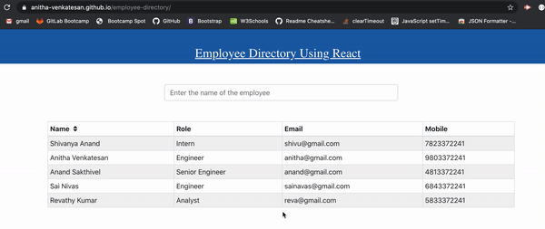

## react employee-directory 
### Description
  * An application to view non-sensitive data about the employees 
  * We can also filter employees by name.
  * Can sort the employees by name
### Installation

Steps to create the react app

`npx create-react-app <your react app name>` 

`cd <your app name>`

`npm start`

Steps to install the dependencies

`npm i`

#### Dependencies
* react-bootstrap
* fortawesome/react-fontawesome
* react-dom
* react-scripts

Note: They already included in npm package.json

### Usage
* `git clone git@github.com:Anitha-Venkatesan/employee-directory.git`
* `cd employee-directory`
* Open employee-directory folder in Command Line Terminal then run command `npm start`
* Runs the app in the development mode. 
* Open [http://localhost:3000](http://localhost:3000) to view it in the browser.
* The page will reload if you make edits. 

### Screenshots

### Deployed URL
[Demo](https://anitha-venkatesan.github.io/employee-directory/)

### License
* This program is licensed under the MIT license.
### Questions
* If you have any questions, Please feel free to contact me Anitha Venkatesan on my email anithamca68@gmail.com

* You can also create [issues](https://github.com/Anitha-Venkatesan/employee-directory/issues) on my repo.

